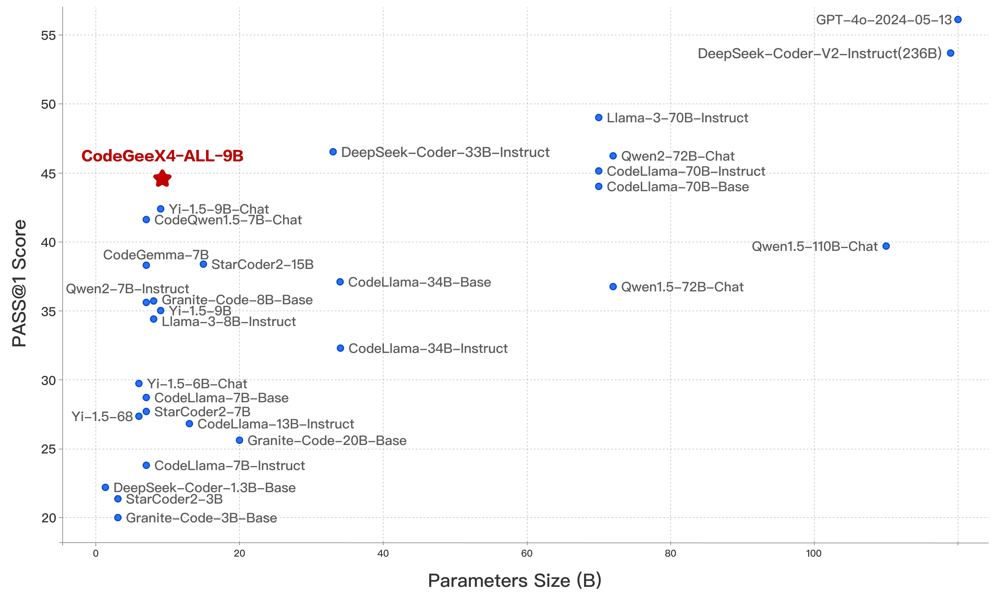

[English](README.md) | [中文](README_zh.md) | [日本語](README_ja.md)

# CodeGeeX4: オープンマルチリンガルコード生成モデル

最新のCodeGeeX4モデルシリーズのオープンソースバージョンであるCodeGeeX4-ALL-9Bを紹介します。これは[GLM-4-9B](https://github.com/THUDM/GLM-4)の上で継続的にトレーニングされた多言語コード生成モデルであり、そのコード生成能力を大幅に向上させました。単一のCodeGeeX4-ALL-9Bモデルを使用することで、コード補完と生成、コードインタープリタ、ウェブ検索、関数呼び出し、リポジトリレベルのコードQ&Aなど、ソフトウェア開発のさまざまなシナリオをカバーする包括的な機能をサポートできます。CodeGeeX4-ALL-9Bは、[BigCodeBench](https://huggingface.co/datasets/bigcode/bigcodebench)や[NaturalCodeBench](https://github.com/THUDM/NaturalCodeBench)などの公開ベンチマークで非常に競争力のあるパフォーマンスを達成しました。現在、10B未満のパラメータを持つ最も強力なコード生成モデルであり、はるかに大きな汎用モデルをも超え、推論速度とモデル性能のバランスを最適に達成しています。

## モデルリスト

| モデル             | タイプ | シーケンス長 | ダウンロード                                                                                                                                                                                                    |
|-------------------|------|------------|-------------------------------------------------------------------------------------------------------------------------------------------------------------------------------------------------------------|
| codegeex4-all-9b  | チャット | 128K       | [🤗 Huggingface](https://huggingface.co/THUDM/codegeex4-all-9b) [🤖 ModelScope](https://modelscope.cn/models/ZhipuAI/codegeex4-all-9b) [🟣 WiseModel](https://wisemodel.cn/models/ZhipuAI/codegeex4-all-9b)    |

## クイックスタート

### Ollama
CodeGeeX4は[Ollama](https://ollama.com/library/codegeex4)で利用可能です！
[Ollama 0.2](https://github.com/ollama/ollama/releases/tag/v0.2.0)以降をインストールし、以下のコマンドを実行してください：
```bash
ollama run codegeex4
```
ローカルモデルを[VS Code](https://marketplace.visualstudio.com/items?itemName=aminer.codegeex) / [Jetbrains](https://plugins.jetbrains.com/plugin/20587-codegeex)拡張機能に接続するには、[ローカルモードガイドライン](./guides/Local_mode_guideline.md)を確認してください。

### Huggingface transformers
`4.39.0<=transformers<=4.40.2`を使用して[codegeex4-all-9b](https://huggingface.co/THUDM/codegeex4-all-9b)を迅速に起動します：

```python
import torch
from transformers import AutoTokenizer, AutoModelForCausalLM

device = "cuda" if torch.cuda.is_available() else "cpu"
tokenizer = AutoTokenizer.from_pretrained("THUDM/codegeex4-all-9b", trust_remote_code=True)
model = AutoModelForCausalLM.from_pretrained(
    "THUDM/codegeex4-all-9b",
    torch_dtype=torch.bfloat16,
    low_cpu_mem_usage=True,
    trust_remote_code=True
).to(device).eval()
inputs = tokenizer.apply_chat_template([{"role": "user", "content": "write a quick sort"}], add_generation_prompt=True, tokenize=True, return_tensors="pt", return_dict=True ).to(device)
with torch.no_grad():
    outputs = model.generate(**inputs)
    outputs = outputs[:, inputs['input_ids'].shape[1]:]
    print(tokenizer.decode(outputs[0], skip_special_tokens=True))
```

### vLLM
`vllm==0.5.1`を使用して[codegeex4-all-9b](https://huggingface.co/THUDM/codegeex4-all-9b)を迅速に起動します：
```
from transformers import AutoTokenizer
from vllm import LLM, SamplingParams

# CodeGeeX4-ALL-9B
# max_model_len, tp_size = 1048576, 4
# OOMが発生した場合、max_model_lenを減らすか、tp_sizeを増やしてください
max_model_len, tp_size = 131072, 1
model_name = "codegeex4-all-9b"
prompt = [{"role": "user", "content": "Hello"}]

tokenizer = AutoTokenizer.from_pretrained(model_name, trust_remote_code=True)
llm = LLM(
    model=model_name,
    tensor_parallel_size=tp_size,
    max_model_len=max_model_len,
    trust_remote_code=True,
    enforce_eager=True,
    # OOMが発生した場合、以下のパラメータを試してください
    # enable_chunked_prefill=True,
    # max_num_batched_tokens=8192
)
stop_token_ids = [151329, 151336, 151338]
sampling_params = SamplingParams(temperature=0.95, max_tokens=1024, stop_token_ids=stop_token_ids)

inputs = tokenizer.apply_chat_template(prompt, tokenize=False, add_generation_prompt=True)
outputs = llm.generate(prompts=inputs, sampling_params=sampling_params)

print(outputs[0].outputs[0].text)
```
vllmを介してOpenAI互換サーバーを設定します。詳細は[OpenAI互換サーバー](https://docs.vllm.ai/en/latest/serving/openai_compatible_server.html)を確認してください。
```
python -m vllm.entrypoints.openai.api_server \
     --model THUDM/codegeex4-all-9b \
     --trust_remote_code
```

### Rust-candle
Codegeex4は現在Candleフレームワークをサポートしています [Repo](https://github.com/huggingface/candle/blob/main/candle-examples/examples/codegeex4-9b/README.org)
#### Cli
Rustを使用して[codegeex4-all-9b](https://huggingface.co/THUDM/codegeex4-all-9b)を起動します：
``` shell
	cd candle_demo
	cargo build -p codegeex4-cli --release --features cuda # for Cuda
	cargo build -p codegeex4-cli --release # for cpu
	./target/release/codegeex4-cli --sample-len 512
```


## チュートリアル
CodeGeeX4-ALL-9Bは、ユーザーがモデルを迅速に理解し、使用するのを支援するために3つのユーザーガイドを提供します：


1. **[システムプロンプトガイドライン](./guides/System_prompt_guideline.md)**：このガイドでは、CodeGeeX4-ALL-9Bでシステムプロンプトを使用する方法を紹介します。VSCode拡張機能の公式システムプロンプト、カスタマイズされたシステムプロンプト、およびマルチターン対話履歴を維持するためのいくつかのヒントが含まれています。

2. **[インフィリングガイドライン](./guides/Infilling_guideline.md)**：このガイドでは、VSCode拡張機能の公式インフィリング形式について説明します。一般的なインフィリング、クロスファイルインフィリング、およびリポジトリ内で新しいファイルを生成することをカバーしています。

3. **[リポジトリタスクガイドライン](./guides/Repository_tasks_guideline.md)**：このガイドでは、CodeGeeX4-ALL-9Bでリポジトリタスクを使用する方法を示します。リポジトリレベルのQAタスク、およびCodeGeeX4-ALL-9Bのaicommiter機能をトリガーして、リポジトリレベルでファイルの削除、追加、および変更を実行する方法が含まれています。

4. **[ローカルモードガイドライン](./guides/Local_mode_guideline.md)**：このガイドでは、CodeGeeX4-ALL-9Bをローカルにデプロイし、Visual Studio Code / Jetbrains拡張機能に接続する方法を紹介します。

これらのガイドは、モデルの包括的な理解を提供し、効率的な使用を促進することを目的としています。

## 評価

CodeGeeX4-ALL-9Bは、10億パラメータ未満の最も強力なモデルとしてランク付けされており、はるかに大きな一般モデルをも超え、推論性能とモデルの有効性の間で最適なバランスを達成しています。

| **モデル**                   | **シーケンス長** | **HumanEval** | **MBPP** | **NCB** | **LCB** | **HumanEvalFIM** | **CRUXEval-O** |
|-----------------------------|----------------|---------------|----------|---------|---------|------------------|----------------|
| Llama3-70B-intruct          | 8K             | 77.4          | 82.3     | 37.0    | 27.4    | -                | -              |
| DeepSeek Coder 33B Instruct | 16K            | 81.1          | 80.4     | 39.3    | 29.3    | 78.2             | 49.9           |
| Codestral-22B               | 32K            | 81.1          | 78.2     | 46.0    | 35.3    | 91.6             | 51.3           |
| CodeGeeX4-All-9B            | 128K           | 82.3          | 75.7     | 40.4    | 28.5    | 85.0             | 47.1           |

CodeGeeX4-ALL-9Bは、BigCodeBenchの`complete`および`instruct`タスクでそれぞれ`48.9`および`40.4`のスコアを獲得しました。これは、20億パラメータ未満のモデルの中で最高のスコアです。

CRUXEvalでは、コードの推論、理解、および実行能力をテストするためのベンチマークであり、CodeGeeX4-ALL-9BはそのCOT（chain-of-thought）能力で優れた結果を示しました。HumanEvalやMBPPのような簡単なコード生成タスクから、NaturalCodeBenchの非常に挑戦的なタスクまで、CodeGeeX4-ALL-9Bはそのスケールで優れたパフォーマンスを達成しました。現在、Function Call機能をサポートする唯一のコードモデルであり、GPT-4よりも高い実行成功率を達成しています。

さらに、「Code Needle In A Haystack」（NIAH）評価では、CodeGeeX4-ALL-9Bモデルは128Kまでのコンテキスト内でコードを検索する能力を示し、すべてのPythonスクリプトで100％の検索精度を達成しました。
<p align="center">
  
  
</p>

評価結果の詳細は**[評価](./metric/README.md)**で確認できます。


## ライセンス

このリポジトリのコードは[Apache-2.0](https://www.apache.org/licenses/LICENSE-2.0)ライセンスの下でオープンソースです。モデルの重みは[モデルライセンス](MODEL_LICENSE)の下でライセンスされています。CodeGeeX4-9Bの重みは学術研究のために公開されています。モデルを商業目的で使用したいユーザーは、[登録フォーム](https://bigmodel.cn/mla/form?mcode=CodeGeeX4-ALL-9B)に記入してください。


## 引用

私たちの仕事が役に立った場合は、以下の論文を引用してください：

```bibtex
@inproceedings{zheng2023codegeex,
  title={CodeGeeX: A Pre-Trained Model for Code Generation with Multilingual Benchmarking on HumanEval-X},
  author={Qinkai Zheng and Xiao Xia and Xu Zou and Yuxiao Dong and Shan Wang and Yufei Xue and Zihan Wang and Lei Shen and Andi Wang and Yang Li and Teng Su and Zhilin Yang and Jie Tang},
  booktitle={Proceedings of the 29th ACM SIGKDD Conference on Knowledge Discovery and Data Mining},
  pages={5673--5684},
  year={2023}
}
```
